<div align="center">

# ☠ necrometer action

**carves the necrometer card into your repo, daily.**

[](https://necrometer.dev/?u=necrometer-dev)

### → [necrometer.dev](https://necrometer.dev) ←

</div>

---

## use

`.github/workflows/necrometer.yml`:

```yaml
name: necrometer
on:
  schedule: [{cron: "17 6 * * *"}]   # daily
  workflow_dispatch:
permissions: { contents: write }
jobs:
  necrometer:
    runs-on: ubuntu-latest
    steps:
      - uses: actions/checkout@v4
      - uses: necrometer-dev/necrometer-action@v1
        with:
          token: ${{ secrets.NECRO_TOKEN || secrets.GITHUB_TOKEN }}
```

That's the whole rite. The action summons the pinned
[necrometer release](https://github.com/necrometer-dev/necrometer/releases),
verifies its `SHA256SUMS`, carves `necrometer.svg` at repo root, and commits it
when the reading changes. Trigger the workflow once to get the card now.

Then bind it in your README:

```markdown
[](https://necrometer.dev/?u=OWNER)
```

## inputs

| input | default | meaning |
|---|---|---|
| `subject` | repo owner | user or org to weigh |
| `file` | `necrometer.svg` | where the card is carved |
| `token` | `GITHUB_TOKEN` | pass `secrets.NECRO_TOKEN` for orgs with private repos |
| `release` | `v0.4.3` | which release to summon |

## rules of the craft

- The binary is pinned to a release tag and checksum-verified before it runs —
  the workflow never executes mutable remote code.
- Nothing is hosted by necrometer.dev. The card lives in your repo; GitHub's
  runners do the digging.
- Repo must be checked out first (`actions/checkout`) — the action commits and
  pushes the card itself.

---

<sub>engine: [necrometer-dev/necrometer](https://github.com/necrometer-dev/necrometer) · site: [necrometer-dev.github.io](https://github.com/necrometer-dev/necrometer-dev.github.io)</sub>
